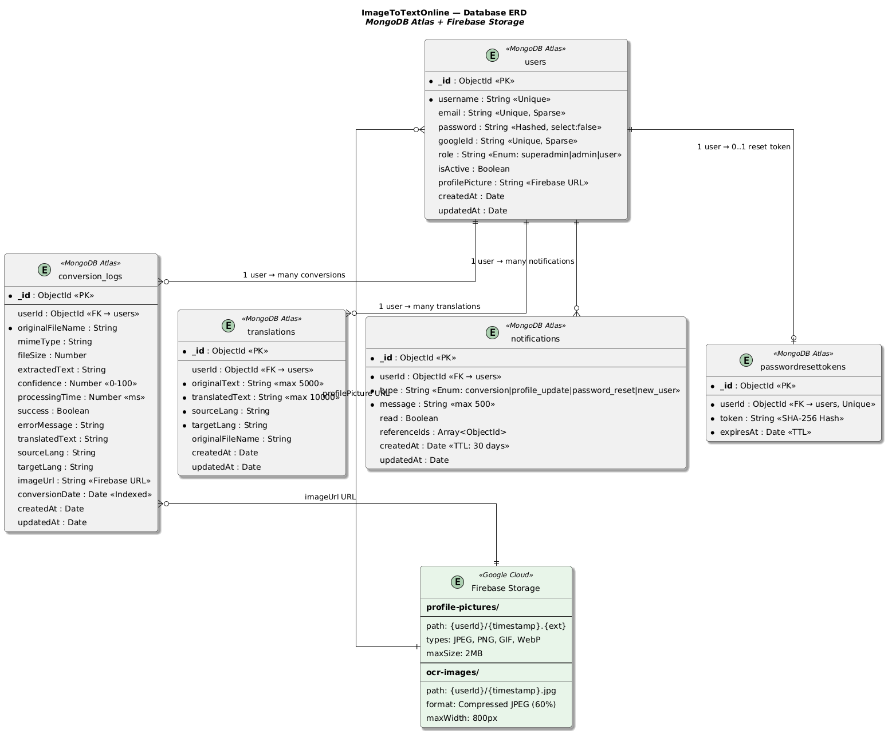
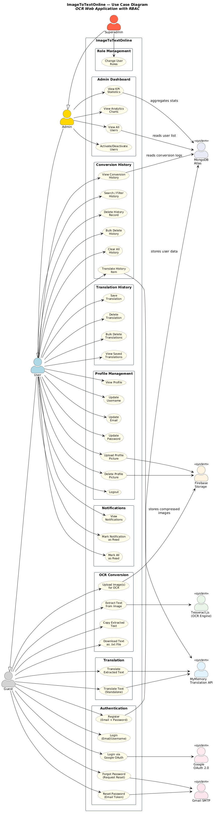

# 🔍 ImageToTextOnline — OCR Web Application


> A full-stack OCR web application that converts images to editable text using Tesseract.js, with JWT + Google OAuth authentication, Firebase Storage, SMTP password reset, real-time notifications, role-based access control, and a full admin dashboard.

---

## 📋 Table of Contents

1. [Description](#-description)
2. [Purpose & Goal](#-purpose--goal)
3. [Live Deployment](#-live-deployment)
4. [Default User Accounts & Role Access](#-default-user-accounts--role-access)
5. [Features](#-features)
6. [Tech Stack](#-tech-stack)
7. [Project Directory Structure](#-project-directory-structure)
8. [Architecture & Design Patterns](#-architecture--design-patterns)
9. [Database Plan](#-database-plan)
10. [REST API Endpoints](#-rest-api-endpoints)
11. [Setup & Installation (Local)](#-setup--installation-local)
12. [Accessing the Application](#-accessing-the-application)
13. [Testing](#-testing)
14. [Project Documentation Links](#-project-documentation-links)
15. [Security Implementation](#-security-implementation)
16. [Development Phases](#-development-phases)

---

## 📝 Description

**ImageToTextOnline** is a web application that turns images into text. You upload a photo (JPG, PNG, GIF, BMP, WebP, JFIF, HEIC, or even a PDF), and the app reads the text from it using OCR (Optical Character Recognition) powered by Tesseract.js. You can upload up to 5 files at once, copy or download the results, and even translate the extracted text into different languages.

The app also comes with user accounts (sign up with email or Google), profile pictures, password reset via email, conversion history, real-time notifications, and a full admin dashboard. There are four levels of access: Guest, User, Admin, and Superadmin, each with different permissions.

Built with Node.js, Express 5, MongoDB Atlas, and a vanilla HTML/CSS/JS + Bootstrap 5 frontend.

---

## 🎯 Purpose & Goal

The goal of this project is to give anyone a free, easy-to-use tool for pulling text out of images right from their browser. No need to install anything. Just open the website, upload your image, and get the text.

On top of that, the app is built with real-world features you would find in production applications: secure login (with Google sign-in as an option), an admin panel to manage users, a history page so you can look back at past conversions, and proper security measures to keep everything safe.

---

## 🌐 Live Deployment

🔗 **Live App:** [web-tech-app.vercel.app](https://web-tech-app.vercel.app/)

The application is deployed on **Vercel** as a full-stack app (frontend + backend + MongoDB Atlas + Firebase Storage + Google OAuth).

---

## 👤 Default User Accounts & Role Access

Seeded by `seeder.js`:

| Username | Role | Password |
|----------|------|----------|
| admin-user | **superadmin** | `eX6LooLPiVfCuZF6` |
| test-user | **user** | `VitBxRJVNwqdHLsQ` |

> **💡 Recommendation:** We highly advise that you create your own account to experience the full functionality of the application, including profile management, conversion history, notifications, and translation history.

### RBAC Permission Matrix

| Permission | Guest | User | Admin | Superadmin |
|-----------|:-----:|:----:|:-----:|:----------:|
| OCR Conversion + Copy/Download | ✅ | ✅ | ✅ | ✅ |
| Translate OCR Results (auto-tracked) | ✅ | ✅ | ✅ | ✅ |
| Register / Login (Email or Google) | ✅ | ✅ | ✅ | ✅ |
| Save Conversion History | ❌ | ✅ | ✅ | ✅ |
| View / Delete Own History | ❌ | ✅ | ✅ | ✅ |
| Real-Time Notifications | ❌ | ✅ | ✅ | ✅ |
| Profile Management (Username, Email, Password) | ❌ | ✅ | ✅ | ✅ |
| Upload / Delete Profile Picture | ❌ | ✅ | ✅ | ✅ |
| Reset Password via Email | ❌ | ✅ | ✅ | ✅ |
| Admin Dashboard + User Management | ❌ | ❌ | ✅ | ✅ |
| Change User Roles | ❌ | ❌ | ❌ | ✅ |

---

## ✨ Features

### Core
- ✅ **OCR Conversion** — Tesseract.js engine, batch upload (up to 5), confidence scores
- ✅ **Multi-Format** — JPG, PNG, GIF, BMP, WebP, JFIF, HEIC, PDF
- ✅ **Copy / Download** — One-click clipboard copy or `.txt` export
- ✅ **Separate OCR Pages** — Guest landing page (`index.html`) and authenticated converter (`home.html`)
- ✅ **Translation API** — MyMemory Translation API integration (20 languages + CJK auto-detect), translate OCR results from any page, auto-saves every translation for all users (guest + authenticated) for real-time KPI tracking, full CRUD on saved translations

### User
- ✅ **Email + Password Auth** — Registration, login (email or username), logout with JWT cookies
- ✅ **Google OAuth 2.0** — One-click sign-in/sign-up via Google
- ✅ **Forgot Password** — SMTP email with tokenized reset link (1-hour expiry)
- ✅ **Profile Management** — Update username, email, password from settings
- ✅ **Profile Picture** — Upload/delete via Firebase Storage
- ✅ **Conversion History** — Unified 6-column table (Date, File, Snippet, Translation, Type, Actions), paginated (10/page), searchable by date/file/type/language, bulk select + delete, image thumbnails, translate/re-translate from Actions column, Firebase image storage for all conversions (guest + auth)
- ✅ **Notifications** — Bell icon with unread badge, notification sound, mark as read
- ✅ **Terms of Service & Privacy Policy** — Scrollable modals on registration page

### UX & Navigation
- ✅ **Clean URLs** — No `.html` extensions (e.g., `/auth/login`, `/dashboard`, `/settings`)
- ✅ **Loading Overlays** — Smooth page transition animations on all navigation links, logo, and user-link clicks
- ✅ **Sound Effects** — Web Audio API sounds for success, error, notification, and page transitions (SoundManager)
- ✅ **404 Error Pages** — Dedicated catch-all pages for guest and authenticated users with themed design
- ✅ **Back-Button Protection** — Guest page prevents back navigation; login back → homepage; post-logout history prevention
- ✅ **Welcome Header** — Username/avatar in desktop header on home page, hoverable with teal underline transition

### Admin
- ✅ **KPI Analytics Dashboard** — 12 real-time stat cards (3 rows: Users, Conversions, Detailed Metrics including guest conversions, avg confidence, avg processing time, storage used, saved images), 4 Chart.js animated visualizations (conversions trend line, user distribution doughnut, file type horizontal bar, popular languages bar), global date filter bar + independent per-chart filters (DB-driven dropdowns for file types and languages, trend day buttons, distribution dropdown), hover lift animations on chart boxes only
- ✅ **User Management** — Dedicated admin page (`/admin/users`): view, search, activate/deactivate users with table + mobile card views, unified Bootstrap pagination
- ✅ **Role Management** — Superadmin-exclusive role promotion/demotion

### Responsiveness
- ✅ **Responsive Design** — Fully responsive from 4K desktop to Apple Watch (≤280px), with dedicated breakpoints at ≤360px (small screens) and ≤280px (smartwatch), all buttons/icons/text/visuals/charts/modals/forms scale proportionally, `min-width: 160px` floor

### Security
- ✅ **Helmet.js** — HTTP security headers
- ✅ **Rate Limiting** — Global (300/15min, bypassed for authenticated users), auth (20/15min), login (10/15min)
- ✅ **CORS Hardening** — Exposed rate-limit headers, 24hr preflight cache, `X-Content-Type-Options: nosniff`
- ✅ **Input Validation** — express-validator on all endpoints
- ✅ **Centralized Error Handler** — AppError class with Mongoose/JWT/Multer error mapping
- ✅ **Anti-Cache Headers** — `no-store`, `no-cache`, `must-revalidate` on sensitive pages
- ✅ **Gzip Compression** — `compression` middleware for response optimization
- ✅ **Morgan Logging** — HTTP request logging (`dev` in development, `combined` in production)

---

## 🛠 Tech Stack

### Backend

| Technology | Purpose |
|-----------|---------|
| Node.js (v20+) | JavaScript runtime |
| Express.js (v5) | Web framework |
| MongoDB Atlas + Mongoose | Database + ODM |
| Tesseract.js | OCR engine |
| Firebase Admin SDK | Profile picture + conversion image storage |
| MyMemory Translation API | Third-party text translation (20 languages, free tier) |
| sharp | Image compression (JPEG, 60% quality, max 800px) |
| Passport.js + Google OAuth 2.0 | Social authentication |
| bcrypt | Password hashing |
| jsonwebtoken | JWT token management |
| nodemailer | SMTP email (password reset) |
| helmet | HTTP security headers |
| express-validator | Input validation |
| express-rate-limit | Rate limiting (with auth bypass) |
| multer | File upload handling |
| heic-convert | HEIC → JPEG conversion |
| unpdf | PDF text extraction |
| cookie-parser | Cookie parsing |
| cors | Cross-origin policy |
| morgan | HTTP request logging |
| compression | Gzip response compression |
| dotenv | Environment configuration |

### Testing

| Technology | Purpose |
|-----------|---------|
| Jest | Unit, integration, and security test framework (ESM mode) |
| Supertest | HTTP endpoint testing for Express routes |
| Puppeteer | Browser automation for functional testing |
| Postman | Manual API testing and security validation |
| Google Lighthouse | Performance and accessibility auditing |

### Frontend

| Technology | Purpose |
|-----------|---------|
| HTML5 / CSS3 / JavaScript (ES6+) | Structure, styling, logic |
| Bootstrap 5.3.2 + Icons | UI framework + icon library |
| Chart.js 4.4 + chartjs-adapter-date-fns | KPI data visualizations (line, doughnut, bar charts) with date axis |
| date-fns | Date utility library (Chart.js time axis adapter) |
| Google Fonts (Poppins) | Typography |

---

## 📁 Project Directory Structure

```
web-tech-app/
├── .gitignore
├── README.md
├── index.html                              # GitHub Pages redirect
├── vercel.json                             # Vercel deployment config
│
├── docs/                                   # Documentation assets (diagrams)
│   ├── db-diagram.png                      # Entity Relationship Diagram
│   └── usecase-diagram.png                 # Use Case Diagram
│
├── backend/
│   ├── .env                                # Environment variables (not committed)
│   ├── firebase-service-account.json       # Firebase credentials (not committed)
│   ├── package.json
│   ├── server.js                           # Express entry point
│   ├── seeder.js                           # Default account seeder
│   ├── jest.config.js                      # Jest test configuration (ESM)
│   ├── eng.traineddata                     # Tesseract English data
│   │
│   ├── __tests__/                          # Automated test suite
│   │   ├── fixtures/
│   │   │   └── test-image.png              # Test image for OCR tests
│   │   ├── integration/
│   │   │   └── auth.test.js                # Integration tests (IT-001 to IT-023)
│   │   ├── security/
│   │   │   └── security.test.js            # Security tests (rate limiting, headers, RBAC)
│   │   └── unit/
│   │       ├── auth.test.js                # Unit tests (validation, regex, hashing)
│   │       └── password.test.js            # Password validation unit tests
│   │
│   ├── config/
│   │   ├── db.js                           # MongoDB connection + retry
│   │   └── passport.js                     # Google OAuth strategy
│   │
│   ├── controllers/
│   │   ├── admin.controller.js             # Stats (KPI, charts, filters), user management
│   │   ├── auth.controller.js              # Auth, profile, password reset
│   │   ├── history.controller.js           # History CRUD + bulk ops
│   │   ├── notification.controller.js      # Notifications
│   │   ├── ocr.controller.js               # OCR processing + Firebase image upload
│   │   └── translation.controller.js       # MyMemory API translation + CRUD
│   │
│   ├── middleware/
│   │   ├── admin.middleware.js             # adminOnly, superadminOnly
│   │   ├── auth.middleware.js              # protect, optionalAuth
│   │   ├── error.middleware.js             # Centralized error handler
│   │   ├── rateLimiter.middleware.js       # Rate limiting tiers
│   │   ├── upload.middleware.js            # Multer config
│   │   ├── validate.middleware.js          # express-validator rules
│   │   └── validateFile.middleware.js      # File type/size checks
│   │
│   ├── models/
│   │   ├── ConversionLog.model.js          # OCR history records (14 fields incl. image, confidence, mimeType)
│   │   ├── Notification.model.js           # User notifications
│   │   ├── PasswordResetToken.model.js     # Password reset tokens
│   │   ├── Translation.model.js            # Saved translations (userId optional for guest tracking)
│   │   └── User.model.js                  # User accounts
│   │
│   ├── routes/
│   │   ├── admin.routes.js                 # /api/admin/*
│   │   ├── auth.routes.js                  # /api/auth/* (incl. OAuth)
│   │   ├── history.routes.js               # /api/history/*
│   │   ├── notification.routes.js          # /api/notifications/*
│   │   ├── ocr.routes.js                   # /api/ocr/*
│   │   └── translation.routes.js           # /api/translate + /api/translations/*
│   │
│   └── utils/
│       ├── email.js                        # SMTP email sending
│       ├── emailValidator.js               # DNS MX record email domain validation
│       ├── firebase.js                     # Firebase upload/delete
│       └── ocrProcessor.js                 # Tesseract worker pool
│
└── frontend/
    ├── index.html                          # Guest landing page + OCR converter
    ├── home.html                           # Authenticated OCR converter (dashboard nav)
    ├── 404.html                            # Guest 404 error page
    ├── 404-auth.html                       # Authenticated 404 error page
    ├── admin/
    │   ├── dashboard.html                  # Admin dashboard
    │   ├── settings.html                   # Account settings
    │   └── users.html                      # User management (admin-only)
    ├── auth/
    │   ├── forgot-password.html            # Forgot password form
    │   ├── login.html                      # Login (email/username + Google OAuth)
    │   ├── register.html                   # Registration (with TOS & Privacy modals)
    │   └── update-password.html            # Reset password (email link)
    ├── css/
    │   └── style.css                       # Main stylesheet
    ├── js/
    │   ├── auth.js                         # Auth logic + sound integration
    │   ├── bulk-selection.js               # Checkbox bulk selection
    │   ├── dashboard.js                    # Dashboard logic + translation history + sound integration
    │   ├── loading-overlay.js              # Page transition animations + sound
    │   ├── main.js                         # Core OCR + translation UI + sound integration
    │   ├── notifications.js                # Notification manager + sound
    │   ├── settings.js                     # Settings page logic + sound integration
    │   └── sound-manager.js                # Web Audio API sound effects (4 sounds)
    └── assets/                             # Static assets (icons, images)
```

---

## 🏗 Architecture & Design Patterns

### MVC Pattern

```
Client Request → Routes → Middleware → Controllers → Models → MongoDB / Firebase
```

| Layer | Location | Responsibility |
|-------|----------|---------------|
| **Model** | `models/` | Database schemas, validation, Mongoose hooks |
| **View** | `frontend/` | HTML/CSS/JS served as static files |
| **Controller** | `controllers/` | Business logic, `next(error)` on failure |
| **Routes** | `routes/` | URL mapping + middleware chains |
| **Middleware** | `middleware/` | Auth, validation, rate limiting, error handling |
| **Config** | `config/` | Database connection, OAuth strategy |
| **Utils** | `utils/` | OCR engine, Firebase storage, SMTP email |

---

## 🗄 Database Plan

The application uses **MongoDB Atlas** as the primary database for all structured data (accessed via Mongoose ODM) and **Firebase Storage** for file storage (images). The schema follows Third Normal Form (3NF). For the full worksheet with detailed field types, constraints, data flows, and UI element mappings, see the [Database Plan Worksheet](https://docs.google.com/document/d/1r80j_zMcLkCDaHwG_qaypV6PmCfoDlVMWRUAlrRbg6Y/edit?usp=sharing).

### Collections (5)

| Collection | Purpose | Documents Store |
|---|---|---|
| **users** | User accounts, authentication credentials, roles, and profile picture URLs | Usernames, emails, bcrypt-hashed passwords, Google OAuth IDs, role assignments (`user`/`admin`/`superadmin`), account status, Firebase Storage profile picture URLs |
| **conversion_logs** | OCR conversion results and history | Original filenames, extracted text, confidence scores, processing times, MIME types, file sizes, translated text, Firebase Storage image URLs. References `users` via `userId` (null for guests) |
| **translations** | Saved text translations from MyMemory API | Original text, translated text, source/target language codes, associated filenames. References `users` via `userId` (null for guests) |
| **notifications** | Real-time user notifications | Notification type (`conversion`, `profile_update`, `password_reset`, `new_user`), message text, read status, linked document IDs. Auto-deletes after 30 days via TTL index |
| **passwordresettokens** | Secure, time-limited password reset tokens | SHA-256 hashed tokens with 15-minute expiry. One token per user (unique index). Auto-deletes on expiry via TTL index |

### CRUD Operations (33 Total)

| Feature Area | Operations |
|---|---|
| **Authentication** | Register user, Login query, Get profile, Check email availability, Verify password, Update username/email/password, Google OAuth create/find |
| **Password Reset** | Generate hashed token + send email, Verify token, Reset password, Delete used token |
| **OCR & History** | Process images + save results + upload to Firebase, List/Get/Delete/Bulk delete/Clear history, Translate history item |
| **Translations** | Translate text via API, Save/List/Update/Delete/Bulk delete/Clear translations |
| **Notifications** | Auto-create on events, List paginated, Count unread, Mark read/Mark all read |
| **Profile Picture** | Upload to Firebase + save URL, Delete from Firebase + clear URL |
| **Admin** | Get all users, Get user details, Toggle user status, Change user role, Dashboard stats aggregation |

### Database Indexes (12)

| Collection | Index | Type | Purpose |
|---|---|---|---|
| **users** | `username` | Unique | Fast login lookup |
| | `email` | Unique (sparse) | Email lookup; allows null for superadmin |
| | `googleId` | Unique (sparse) | Google OAuth lookup |
| | `{ role: 1, isActive: 1 }` | Compound | Admin dashboard queries |
| **conversion_logs** | `{ userId: 1, conversionDate: -1 }` | Compound | User history sorted by date |
| | `{ conversionDate: -1 }` | Single | Recent conversions global queries |
| | `{ success: 1 }` | Single | Filter by success/failure status |
| **translations** | `{ userId: 1, createdAt: -1 }` | Compound | User translations sorted by date |
| | `{ createdAt: -1 }` | Single | Recent translations global queries |
| **notifications** | `{ userId: 1, read: 1, createdAt: -1 }` | Compound | Unread notifications per user |
| | `{ createdAt: 1 }` | TTL (30 days) | Auto-delete old notifications |
| **passwordresettokens** | `{ userId: 1 }` | Unique | One active token per user |
| | `{ expiresAt: 1 }` | TTL (0s) | Auto-delete expired tokens |

### Firebase Storage

Firebase Storage handles binary file storage separately from MongoDB. MongoDB only stores the public URL reference.

| Storage Path | Purpose | Referenced By |
|---|---|---|
| `profile-pictures/{userId}/{timestamp}.{ext}` | User profile pictures (JPEG, PNG, GIF, WebP, max 2MB) | `users.profilePicture` |
| `ocr-images/{userId}/{timestamp}.jpg` | Compressed OCR source images (JPEG, 60% quality, max 800px) | `conversion_logs.imageUrl` |

When a MongoDB document is deleted, the app also deletes the corresponding file from Firebase Storage to prevent orphaned files.

### Entity Relationship Diagram

The ERD visualizes all five MongoDB collections and Firebase Storage with their fields, data types, keys, and relationship cardinalities.



### Use Case Diagram

The Use Case Diagram maps all user interactions across four RBAC actors (Guest, User, Admin, Superadmin) with inheritance, six external systems, and 30+ use cases across eight functional packages.

<p align="center">
  
</p>

---

## 📡 REST API Endpoints

**Base URL:** `/api`

### Authentication

| # | Feature | Endpoint | Method | Parameters | Response |
|---|---------|----------|--------|-----------|----------|
| 1 | Register | `/auth/register` | POST | username, email, password, confirmPassword | success, token, user |
| 2 | Login | `/auth/login` | POST | email, password | success, token, user |
| 3 | Logout | `/auth/logout` | POST | auth cookie | success, message |
| 4 | Get Current User | `/auth/me` | GET | auth cookie | success, user |
| 5 | Check Email | `/auth/check-email` | POST | email | success, exists |
| 6 | Forgot Password | `/auth/forgot-password` | POST | email | success, message |
| 7 | Reset Password | `/auth/reset-password` | POST | token, email, password | success, message |

### Google OAuth

| # | Feature | Endpoint | Method | Description |
|---|---------|----------|--------|-------------|
| 8 | Initiate Login | `/auth/google` | GET | Redirects to Google consent screen |
| 9 | Callback | `/auth/google/callback` | GET | Sets JWT cookie → redirects to `/dashboard` |

### Profile Management (Auth Required)

| # | Feature | Endpoint | Method | Parameters |
|---|---------|----------|--------|-----------|
| 10 | Update Username | `/auth/update-username` | PATCH | username |
| 11 | Update Email | `/auth/update-email` | PATCH | email |
| 12 | Update Password | `/auth/update-password` | PATCH | currentPassword, newPassword, confirmNewPassword |
| 13 | Verify Password | `/auth/verify-password` | POST | password |
| 14 | Upload Profile Pic | `/auth/profile-picture` | POST | profilePicture (form-data, max 2MB) |
| 15 | Delete Profile Pic | `/auth/profile-picture` | DELETE | — |

### OCR

| # | Feature | Endpoint | Method | Parameters |
|---|---------|----------|--------|-----------|
| 16 | Convert Images | `/ocr/convert` | POST | images (form-data, max 5 files, 10MB each) |

### History (Auth Required)

| # | Feature | Endpoint | Method | Parameters |
|---|---------|----------|--------|-----------|
| 17 | Get History | `/history` | GET | page, limit, dateFrom, dateTo |
| 18 | Get Single Item | `/history/:id` | GET | id |
| 19 | Delete Item | `/history/:id` | DELETE | id |
| 20 | Bulk Delete | `/history/bulk-delete` | POST | ids (array) |
| 21 | Clear All | `/history` | DELETE | — |

### Notifications (Auth Required)

| # | Feature | Endpoint | Method | Parameters |
|---|---------|----------|--------|-----------|
| 22 | Get Notifications | `/notifications` | GET | page, limit |
| 23 | Unread Count | `/notifications/unread-count` | GET | — |
| 24 | Mark All Read | `/notifications/read-all` | PATCH | — |
| 25 | Mark One Read | `/notifications/:id/read` | PATCH | id |

### Admin (Admin Role Required)

| # | Feature | Endpoint | Method | Parameters |
|---|---------|----------|--------|-----------|
| 26 | Dashboard Stats | `/admin/stats` | GET | globalDays, trendDays, fileTypeDays, langDays |
| 27 | All Users | `/admin/users` | GET | page, limit |
| 28 | Single User | `/admin/users/:id` | GET | id |
| 29 | Toggle Status | `/admin/users/:id/status` | PATCH | id |
| 30 | Change Role | `/admin/users/:id/role` | PATCH | id, role (**superadmin only**) |

### Utility

| # | Feature | Endpoint | Method | Response |
|---|---------|----------|--------|----------|
| 31 | Health Check | `/health` | GET | status, timestamp, environment |

### Translation

| # | Feature | Endpoint | Method | Parameters |
|---|---------|----------|--------|-----------|
| 32 | Translate Text | `/translate` | POST | text, sourceLang, targetLang |
| 33 | Supported Languages | `/translate/languages` | GET | — |

### Translation History (Auth Required)

| # | Feature | Endpoint | Method | Parameters |
|---|---------|----------|--------|-----------|
| 34 | Save Translation | `/translations` | POST | originalText, translatedText, sourceLang, targetLang, originalFileName |
| 35 | Get Translations | `/translations` | GET | page, limit |
| 36 | Get Single | `/translations/:id` | GET | id |
| 37 | Update Translation | `/translations/:id` | PATCH | translatedText |
| 38 | Delete Translation | `/translations/:id` | DELETE | id |
| 39 | Bulk Delete | `/translations/bulk-delete` | POST | ids (array) |
| 40 | Clear All | `/translations` | DELETE | — |

---

## 🚀 Setup & Installation (Local)

### Prerequisites

- **Node.js** v20+ — [nodejs.org](https://nodejs.org/)
- **Git** — [git-scm.com](https://git-scm.com/)
- **MongoDB Atlas** account — [mongodb.com/atlas](https://www.mongodb.com/atlas)
- **Firebase project** with Storage enabled — [console.firebase.google.com](https://console.firebase.google.com/)
- **Google Cloud** OAuth 2.0 credentials — [console.cloud.google.com](https://console.cloud.google.com/)
- **Gmail App Password** for SMTP — [myaccount.google.com/apppasswords](https://myaccount.google.com/apppasswords)

### Step 1 — Clone & Install

```bash
git clone https://github.com/kleinborre/web-tech-app.git
cd web-tech-app/backend
npm install
```

### Step 2 — Firebase Service Account

Download the Firebase service account JSON and place it at `backend/firebase-service-account.json`:

📥 **Download:** [firebase-service-account.json (Google Drive)](https://drive.google.com/file/d/1XDrP_eZ6B_mfM_7tkojuM3uLD_dbP0cX/view?usp=sharing)

> This file is excluded from Git via `.gitignore`. It grants the backend access to `imagetotextonline.firebasestorage.app`.

### Step 3 — Environment Variables

Create `backend/.env` with the following:

```env
# =============================================================================
# Environment Configuration
# =============================================================================

# Server Configuration
PORT=3000
NODE_ENV=development

# File Upload Configuration
MAX_FILE_SIZE=10485760
MAX_FILES=5

# MongoDB Configuration
MONGO_URI=mongodb+srv://<db_username>:<db_password>@<cluster>.mongodb.net/<database_name>

# JWT Configuration
JWT_SECRET=<your_jwt_secret_key>
JWT_EXPIRE=7d
JWT_COOKIE_EXPIRE=7

# SMTP for Password Reset
SMTP_HOST=smtp.gmail.com
SMTP_PORT=587
SMTP_SECURE=false
SMTP_USER=<your_gmail_address>
SMTP_PASS=<your_gmail_app_password>
BASE_URL=http://localhost:3000

# Firebase Storage (Profile Pictures)
FIREBASE_SERVICE_ACCOUNT_KEY_PATH=./firebase-service-account.json
FIREBASE_STORAGE_BUCKET=<your_project>.firebasestorage.app

# Google OAuth
GOOGLE_CLIENT_ID=<your_client_id>.apps.googleusercontent.com
GOOGLE_CLIENT_SECRET=<your_client_secret>
```

#### Environment Variables Reference

| Variable | Required | Description |
|----------|:--------:|-------------|
| `PORT` | ✅ | Server port (default: 3000) |
| `NODE_ENV` | ✅ | `development` or `production` |
| `MAX_FILE_SIZE` | ✅ | Max upload size in bytes (10MB = 10485760) |
| `MAX_FILES` | ✅ | Max files per OCR request |
| `MONGO_URI` | ✅ | MongoDB Atlas connection string |
| `JWT_SECRET` | ✅ | Secret key for signing JWT tokens |
| `JWT_EXPIRE` | ✅ | Token lifetime (e.g., `7d`) |
| `JWT_COOKIE_EXPIRE` | ✅ | Cookie expiry in days |
| `SMTP_HOST` | ✅ | SMTP server (e.g., `smtp.gmail.com`) |
| `SMTP_PORT` | ✅ | SMTP port (587 for STARTTLS) |
| `SMTP_SECURE` | ✅ | `false` for STARTTLS on port 587 |
| `SMTP_USER` | ✅ | Sender email address |
| `SMTP_PASS` | ✅ | Gmail App Password (not regular password) |
| `BASE_URL` | ✅ | App URL for email links (local or Vercel) |
| `FIREBASE_SERVICE_ACCOUNT_KEY_PATH` | ✅ | Path to Firebase JSON (local: `./firebase-service-account.json`) |
| `FIREBASE_STORAGE_BUCKET` | ✅ | Firebase Storage bucket name |
| `GOOGLE_CLIENT_ID` | ✅ | Google OAuth client ID |
| `GOOGLE_CLIENT_SECRET` | ✅ | Google OAuth client secret |

### Step 4 — Seed Default Accounts

```bash
node seeder.js
```

### Step 5 — Start the Server

```bash
npm run dev     # Development (auto-restart)
npm start       # Production
```

Server runs at `http://localhost:3000`.

---

## 🌐 Accessing the Application

### Local Development

| Page | URL |
|------|-----|
| Home / OCR Converter (Guest) | `http://localhost:3000` |
| Home / OCR Converter (Auth) | `http://localhost:3000/home` |
| Login | `http://localhost:3000/auth/login` |
| Register | `http://localhost:3000/auth/register` |
| Google Sign-In | `http://localhost:3000/api/auth/google` |
| Forgot Password | `http://localhost:3000/auth/forgot-password` |
| Reset Password (from email) | `http://localhost:3000/auth/update-password?token=...&email=...` |
| Dashboard | `http://localhost:3000/dashboard` |
| Account Settings | `http://localhost:3000/settings` |
| User Management (admin-only) | `http://localhost:3000/admin/users` |
| API Health Check | `http://localhost:3000/api/health` |

### Vercel Production

| Page | URL |
|------|-----|
| Home / OCR Converter (Guest) | `https://web-tech-app.vercel.app` |
| Home / OCR Converter (Auth) | `https://web-tech-app.vercel.app/home` |
| Login | `https://web-tech-app.vercel.app/auth/login` |
| Google Sign-In | `https://web-tech-app.vercel.app/api/auth/google` |
| Dashboard | `https://web-tech-app.vercel.app/dashboard` |
| Account Settings | `https://web-tech-app.vercel.app/settings` |
| User Management (admin-only) | `https://web-tech-app.vercel.app/admin/users` |
| API Health Check | `https://web-tech-app.vercel.app/api/health` |

---

## 🧪 Testing

The application underwent comprehensive testing across **5 testing types** with a total of **62 test cases**, all passing. Testing combines automated and manual approaches to ensure full coverage of functionality, security, and user experience.

### Testing Summary

| Testing Type | Test Cases | Method | Tools Used | Coverage |
|---|---|---|---|---|
| **Unit Testing** | UT-001 to UT-015 (15 cases) | Automated | Jest (ESM mode) | Password hashing (bcrypt), JWT generation/verification/expiry, email format regex, password complexity validation (length, uppercase, lowercase, number, special char), email DNS MX record validation, username format regex |
| **Integration Testing** | IT-001 to IT-023 (23 cases) | Automated | Jest + Supertest | Full API endpoint testing — registration (success, duplicate, invalid domain), login (valid, invalid, non-existent), logout, profile retrieval, check-email (existing, fake domain), forgot/reset password (valid, expired), OCR conversion, history CRUD, profile picture (upload, invalid type), admin RBAC (admin access, regular user block), password update, text translation |
| **Functional Testing** | FT-001 to FT-015 (15 cases) | Manual | Browser DevTools, Puppeteer | End-to-end user workflows — registration with real-time validation, login (email/password + Google OAuth), logout, OCR conversion with copy/download, dashboard history with pagination, settings (username, email with DNS check, password with strength meter), profile picture upload, forgot/reset password flow, admin dashboard with user management, page navigation |
| **Security Testing** | ST-001 to ST-014 (14 cases) | Automated + Manual | Jest + Supertest, Postman | XSS prevention (script injection in username, email), NoSQL injection prevention, route protection (no auth, expired JWT, tampered JWT), rate limiting (login, registration), Helmet.js headers (X-Content-Type-Options, Referrer-Policy), RBAC enforcement (user→admin block, admin→superadmin block), file upload validation (oversized files), password field exposure check |
| **Usability Testing** | UST-001 to UST-010 (10 cases) | Manual | Browser DevTools, Google Lighthouse | Navigation flow clarity, error message clarity (invalid login, duplicate email), real-time form validation feedback, password strength indicator, responsive design (mobile 375px), loading states during OCR, email domain validation feedback, cross-browser compatibility (Chrome + Firefox), keyboard accessibility (Tab, Enter, Escape) |

### Test Results

| Metric | Value |
|---|---|
| Total Test Cases | **62** |
| Passed | **62** |
| Failed | **0** |
| Pass Rate | **100%** |

### Defects Found and Resolved

| Defect | Severity | Testing Phase | Resolution |
|---|---|---|---|
| Password reset rejected valid passwords due to field name mismatch (`body.newPassword` vs `body.password`) | Critical | Integration | Fixed (Phase 22) |
| `updatePassword` controller regex missing underscore and pipe from special characters | High | Integration | Fixed (Phase 22) |
| Email validation only checked syntax, allowing fake domains (e.g., `test@zyx.com`) | High | Usability | Fixed (Phase 22) — DNS MX record validation added |
| Password special character regex inconsistent across 8 code locations | Medium | Security | Fixed (Phase 22) — Unified to single standardized regex |

### Running Automated Tests

```bash
cd backend
npm test          # Run all 52 automated tests (Unit + Integration + Security)
```

Automated tests use **Jest** in ESM mode with **Supertest** for real HTTP requests against the Express server. Test files are located in `backend/__tests__/` organized by type (`unit/`, `integration/`, `security/`). The test suite includes automatic cleanup of test users and history records created during testing.

---

## 📄 Project Documentation Links

| Document | Link |
|----------|------|
| Integration Plan | [Google Sheets](https://docs.google.com/spreadsheets/d/16wQOqXFzJkREMpyyzgHibVKAoVvgcOhvo_qOa1gvBoA/edit?usp=sharing) |
| Database Plan Worksheet | [Google Docs](https://docs.google.com/document/d/1r80j_zMcLkCDaHwG_qaypV6PmCfoDlVMWRUAlrRbg6Y/edit?usp=sharing) |
| Test Plan and Test Case Document | [Google Sheets](https://docs.google.com/spreadsheets/d/1H677_7_D8fbhhiazLOhv62b03Ea-tvXcJ6iYPSuo3aQ/edit?usp=sharing) |
| Environment Variables | [Google Docs](https://docs.google.com/document/d/1Soap5sVPvcS5dE5LpLys9niJX-Otc9nOPrQWAFGrvPE/edit?usp=sharing) |
| Firebase Service Account Key | [Google Drive](https://drive.google.com/file/d/1XDrP_eZ6B_mfM_7tkojuM3uLD_dbP0cX/view?usp=sharing) |

---

## 🔒 Security Implementation

| Feature | Implementation |
|---------|---------------|
| **Password Hashing** | bcrypt with salt rounds |
| **JWT Authentication** | HTTPOnly cookies (not localStorage), 7-day expiry |
| **Google OAuth 2.0** | Passport.js, `sameSite: 'lax'` for redirect compatibility |
| **Helmet.js** | X-Frame-Options, HSTS, X-Content-Type-Options, X-XSS-Protection, Referrer-Policy, X-Powered-By removal |
| **Rate Limiting** | Global: 300/15min (bypassed for authenticated users), Auth: 20/15min, Login: 10/15min per IP |
| **CORS Hardening** | Exposed rate-limit headers, 24hr preflight cache, `X-Content-Type-Options: nosniff` on API responses |
| **Anti-Cache Headers** | `no-store`, `no-cache`, `must-revalidate`, `Pragma: no-cache` on sensitive page routes |
| **bfcache Prevention** | Browser back/forward cache disabled to prevent stale session state |
| **Input Validation** | express-validator on all endpoints with field-level errors |
| **Centralized Error Handler** | AppError class mapping Mongoose, JWT, Multer, and JSON parse errors to proper HTTP status codes |
| **RBAC** | Four-tier middleware: guest → user → admin → superadmin |
| **File Validation** | MIME whitelist + size caps (10MB OCR, 2MB profile picture) |
| **Password Reset Tokens** | Bcrypt-hashed, single-use, 1-hour expiry |
| **CORS** | Hardened configuration — exposed rate-limit headers, 24hr preflight cache, restrictive in production |
| **Gzip Compression** | `compression` middleware for optimized response sizes |
| **Morgan Logging** | HTTP request logging — `dev` format in development, `combined` in production |
| **404 Catch-All** | Auth-aware global catch-all serves dedicated 404 pages with HTTP 404 status |
| **Clean URLs** | No `.html` extensions exposed — server-side route aliasing via Express |
| **Environment Secrets** | `.env` + `firebase-service-account.json` excluded via `.gitignore` |

---

## 📌 Development Phases

| Phase | Description |
|-------|-------------|
| **Phase 1** | Project initialization — folder structure, Express 5 server, MongoDB Atlas connection with retry logic |
| **Phase 2** | User authentication — registration, login, logout with JWT tokens in HTTPOnly cookies |
| **Phase 3** | OCR engine — Tesseract.js integration, multi-format support (HEIC auto-conversion, PDF text extraction) |
| **Phase 4** | History & admin — conversion history API with pagination, admin dashboard stats, user management endpoints |
| **Phase 5** | Frontend — responsive UI with Bootstrap 5, admin panel, user management interface, login/register pages |
| **Phase 6** | Polish & docs — clean URL routing, GitHub Pages + Vercel deployment, PDF engine optimization, responsive design (mobile/tablet), admin dashboard chart, account settings page, initial README |
| **Phase 7** | Firebase Storage — profile picture upload, change, and deletion with automatic old-image cleanup |
| **Phase 8** | Google OAuth 2.0 — Passport.js integration, one-click Google sign-in/sign-up, auto user creation, JWT on callback |
| **Phase 9** | Forgot password — SMTP email via Gmail (nodemailer), tokenized reset links with bcrypt hashing and 1-hour expiry, update-password page |
| **Phase 10** | Bug fixes — OAuth session persistence, notification deletion sync (referenceIds), bulk selection v2.0 for history, loading overlays, confirmation dialogs |
| **Phase 11** | Middleware validation — express-validator rules for all endpoints, express-rate-limit (3-tier), MongoDB ObjectId param validation, enhanced JWT error messages |
| **Phase 12** | RBAC refinement — `superadminOnly` middleware on role-change route, user-scoped history verification, frontend role-button visibility |
| **Phase 13** | Security & error handling — Helmet.js headers, centralized `AppError` error handler, refactored all 28 controller functions to `next(error)` |
| **Phase 14** | Documentation — comprehensive README v2.0 update, Vercel deployment guide (Firebase, OAuth, SMTP), updated API endpoint table (31 endpoints), development phase history |
| **Phase 15** | Auth UX & security — anti-cache headers (no-store, no-cache, must-revalidate), bfcache prevention, login loading animation (replaces success modal), logout toast + loading overlay, unauthorized access warning popup, username-or-email login, rate-limit JSON responses, users page JS syntax fix (stray brackets breaking table load), removed spurious `justLoggedIn` flag from `updateUI()`, added loading-overlay to users page, increased rate limits to SPA-friendly levels (global 300/15min, auth 20/15min, login 10/15min), nav link loading animations on all dashboard pages |
| **Phase 16** | Page separation & back-button protection — separate guest OCR (`index.html`) and authenticated OCR (`home.html`) pages, dashboard-style nav on auth pages, post-login back-button sign-out confirmation, post-logout history prevention via `replace()`, active nav item disabled (`pointer-events: none`), gzip compression middleware, Vercel static cache (1yr immutable), clickable welcome/avatar → Settings, OCR modal redesign (Copy/Download/Delete matching dashboard), footer polish (MMDC link, mentor line), Terms of Service & Privacy Policy modals on register page |
| **Phase 17** | Clean URLs & API security — removed `.html` extensions from all internal navigation links (auth, admin, settings), Morgan HTTP request logging (`dev`/`combined`), hardened CORS (exposed rate-limit headers, 24hr preflight cache), `X-Content-Type-Options: nosniff` on API responses, removed stale confirmation dialogs from settings sidebar/mobile nav (replaced with LoadingOverlay), guest page back-button prevention, login page back → homepage redirect |
| **Phase 18** | URL structure & loading animations — separated user/admin URL paths (`/dashboard`, `/settings` for all users; `/admin/users` for admin-only), route aliasing via server.js (no page duplication), updated Google OAuth redirect, loading overlay transitions on all nav links/logo/user-link/dashboard buttons across dashboard.js, settings.js, users.html, and home.html, welcome/username/avatar added to home page desktop header (→ settings), theme-color hover transition on welcome text (home + dashboard pages) |
| **Phase 19** | Global catch-all error pages & UX polish — dedicated `404.html` (guest) and `404-auth.html` (authenticated) with themed hover icon, creative error copy, and redirect button; server.js catch-all detects auth via JWT cookie, returns proper HTTP 404; SoundManager utility (Web Audio API) with 4 synthesized sounds integrated across all pages; settings popup success icon color matched to theme teal; Welcome/username hover: underline + teal color transition; settings welcome/avatar hoverable non-navigating container; rate limiting bypassed for authenticated users via globalLimiter `skip` function |
| **Phase 20** | Comprehensive README update — updated all documentation sections (Features, Tech Stack, Directory Structure, Security Implementation, Accessing the Application, API Endpoints) to reflect Phases 15–19 changes: new files (`404.html`, `404-auth.html`, `sound-manager.js`), clean URL paths (`/dashboard`, `/settings`), updated rate limit values, added new features (sound effects, loading overlays, TOS/Privacy modals, separate OCR pages, back-button protection, anti-cache headers, gzip, Morgan logging, CORS hardening) |
| **Phase 21** | Translation, unified history, image storage, KPI dashboard & UI polish — MyMemory Translation API: `translation.controller.js` (translateText with auto-save for ALL users, CRUD), `Translation.model.js` (userId optional for guest tracking), 9 API endpoints; merged Translation History into Conversion History (6-column layout: Date, File, Snippet, Translation, Type, Actions with translate/copy/download/delete); Firebase image storage: `sharp` compression + upload on OCR for ALL users (guest in `conversions/guest/`), cleanup on delete, thumbnails in table + detail; OCR controller saves all 8 ConversionLog fields + guest conversion tracking (`userId: null`); CJK fix (`autodetect`→`auto`, `zh-CN`/`zh-TW`); unified toast messages; Chart.js 4.4 KPI dashboard: 12 stat cards (3 rows), 4 animated charts with hover lift effect, **global date filter bar** + **independent per-chart filters** (DB-driven file type & language dropdowns, trend day buttons, user distribution dropdown); admin stats API: independent query params (`trendDays`, `fileTypeDays`, `langDays`, `globalDays`), `translatedCount`/languages/`availableLanguages` query Translation model for real-time accuracy; unified Bootstrap pagination across all pages; conversion history: search bar + refresh button (no calendar), 10 items/page default; translation column shows text snippet only (translate moved to Actions); comprehensive responsiveness: ≤360px small-screen breakpoint + ≤280px Apple Watch breakpoint (buttons, icons, text, visuals, charts, navbars, modals, forms, pagination all scale down); `min-width: 160px` floor; removed User Management table from admin dashboard (dedicated `/admin/users` page) |
| **Phase 22** | Password complexity bug fix & email domain validation — fixed password complexity regex allowing passwords without special characters, added DNS MX record validation for email domains during registration (`emailValidator.js`), prevented registration with fake/non-existent email domains |
| **Phase 23** | Username validation fix & automated test suite — standardized username regex to `^[a-zA-Z0-9_-]+$` across backend middleware, frontend auth/settings, and tests; fixed `updateUsername` API body key mismatch (`newUsername` → `username`); added inline username-taken error on registration; implemented 56 automated tests (unit, integration, security) with Jest + Supertest; added `jest.config.js`, `__tests__/` directory with fixtures |
| **Phase 24** | Fix update-email and update-password consistency bugs — fixed critical `updateEmail` API body key mismatch (`newEmail` → `email`) that caused all three validators to fail simultaneously; corrected `updatePassword` controller minimum length from 6 to 8 characters to match middleware and frontend validation; all 56 automated tests passing |
| **Phase 25** | Testing, documentation & final polish — expanded integration tests to cover all 23 test cases (IT-001 to IT-023: registration, login, logout, profile, check-email, forgot/reset password, OCR conversion, history CRUD, profile picture upload/rejection, admin RBAC, password update, translation); created Database Plan Worksheet documenting all 5 MongoDB collections, field types, indexes, CRUD operations, and data flows; generated Entity Relationship Diagram (ERD) and Use Case Diagram with PlantUML; updated README with Vercel-only deployment, new diagram sections, updated documentation links, and complete development phase history |

---

<div align="center">
  <p><strong>ImageToTextOnline</strong> — Built with ☕ by Oliver Jann Klein Borre</p>
  <p><em>MO-IT149 Web Technology Application — Mapua Malayan Digital College</em></p>
  <p>© 2026 Oliver Jann Klein Borre. All rights reserved.</p>
</div>
